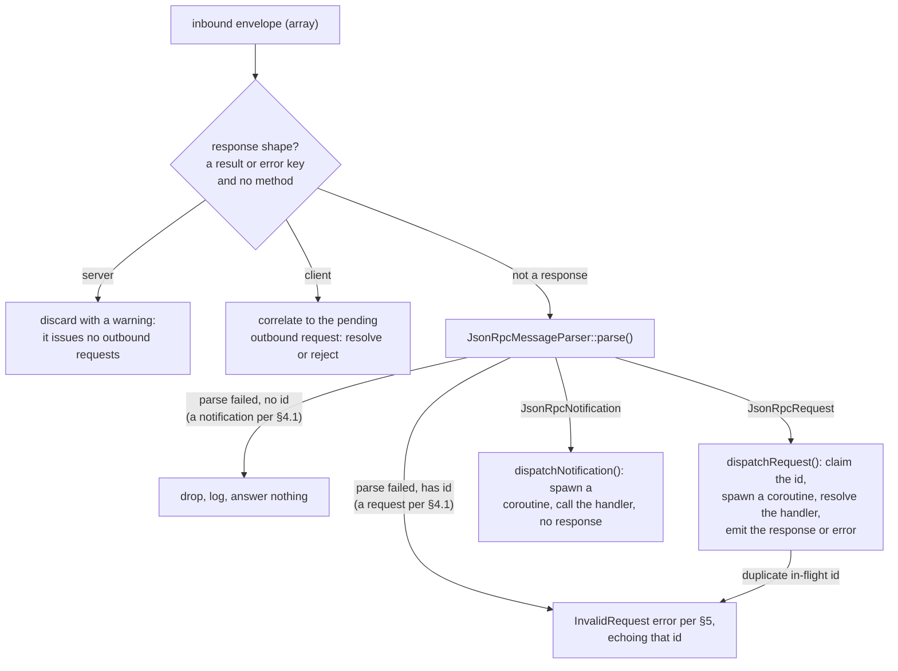

# Architecture

How the SDK is laid out: the namespace tree, the layering rules between namespaces, and the dispatch
kernel that drives every inbound JSON-RPC message. What the SDK covers against the spec is on
[Spec compliance](spec-compliance.md).

## Namespaces

```text
Nexus\Mcp\
├── Core\               Protocol primitives shared by both peers. Depends on no other Mcp namespace
│   ├── Auth\           Authorization vocabulary both peers read: metadata documents, verified tokens, resource identifiers
│   ├── Dispatch\       Shared dispatch contract and in-flight correlation primitives
│   ├── Exception\      McpExceptionInterface marker plus concrete protocol error types
│   ├── Handler\        Handler interfaces, the method-to-handler registry, and the abstract context base
│   │   └── Notification\  Built-in notification handlers both peers register (cancellation)
│   ├── Http\           HTTP vocabulary shared by both sides: status codes, header codecs, Mcp-Param binding and validation
│   ├── JsonRpc\        Envelope parser, method registry, parser-state value objects
│   ├── Schema\         Types only (value objects, enums, interfaces). No behaviour
│   ├── Transport\      Transport contract, lifecycle event keys, shared line-framed duplex, in-memory paired transports for tests
│   ├── UriTemplate\    RFC 6570 Level 1 matching
│   └── Validation\     URI templates, RFC 3339, enum-value coercion
├── Server\             Server-side composition. Depends on Core only
│   ├── Attribute\      #[AsTool], #[AsPrompt], #[AsResource], #[AsResourceTemplate], #[AsCompletion], #[AsServer]
│   ├── Auth\           Resource-server side: the access-token validator contract
│   ├── Completion\     Completion store contract and providers
│   ├── Discovery\      Attribute scanner behind ServerBuilder::register()
│   ├── Dispatch\       Server-side per-envelope inbound pipeline
│   ├── Exception\      Server-side error types
│   ├── Handler\
│   │   └── Request\    Built-in server request handlers
│   ├── Prompt\         Prompt store plus renderer adapters
│   ├── Resource\       Static and templated resource stores plus reader adapters
│   ├── Subscription\   Open subscriptions/listen streams and the fanout that reaches them
│   ├── Tool\           Tool store plus executor adapters
│   ├── Transport\      Server-side transport implementations
│   │   └── Http\       Streamable HTTP endpoint composition
│   │       └── Middleware\  PSR-15 middleware: CORS, DNS rebinding, bearer auth, body size, parameter headers
│   └── Validation\     Pluggable JSON Schema validator contract plus the opis-backed default
└── Client\             Client-side composition. Depends on Core only
    ├── Auth\           OAuth 2.1 client: metadata discovery, registration, token endpoint, the authorizing HTTP decorator
    ├── Dispatch\       Client-side per-envelope inbound pipeline
    ├── Exception\      Client-side local-misuse errors (not connected, already connected, unadvertised server capability)
    ├── Handler\
    │   └── Notification\  Built-in client notification handlers (progress routing)
    ├── Subscription\   Open `subscriptions/listen` streams, their notification routing, and their replay across a reconnect
    └── Transport\      Client-side transport implementations
```

### Layering rules

- **`Core` depends on no other `Nexus\Mcp` namespace.** It is the shared vocabulary both server-side and
  client-side consume.
- **`Core/Schema/` is types only.** No parsers, no codecs, no registries. Behaviour for those lives in
  sibling namespaces (`Core/JsonRpc/`, `Core/Validation/`, `Core/UriTemplate/`). Abstract bases sit at the
  namespace root with concrete subclasses in same-named subfolders (`Schema/Result.php` +
  `Schema/Result/EmptyResult.php`, `Schema/Request.php` + `Schema/Request/DiscoverRequest.php`, etc.).
- **`Server` depends on `Core` only.** No back-references from `Core` into `Server`.
- **`Client` depends on `Core` only.** `Server` and `Client` are symmetric peers, neither depending on the
  other.

## The `Arrayable` contract

Every JSON-RPC envelope, params block, and result type implements
[`Nexus\Mcp\Core\Schema\Arrayable`](../src/Core/Schema/Arrayable.php). The contract gives every schema class
three matching shapes:

| Method | Direction |
| --- | --- |
| `static fromArray(array $data): static` | envelope → PHP value object |
| `toArray(): array` | PHP value object → envelope (round-trip representation) |
| `jsonSerialize(): array\|\stdClass` | PHP value object → envelope (what `json_encode` emits) |

`toArray()` and `jsonSerialize()` usually return the same shape. When they diverge intentionally (e.g. an
empty object slot that should encode as `{}` instead of `[]`), the class substitutes `\stdClass` in
`jsonSerialize()` and opts in to the `encodingPathsDiverge` flag in the auto-review round-trip fixture
registry. The `AbstractRoundTripTestCase` asserts `json_encode($x) === json_encode($x->toArray())` for every
other class, so drift between the two paths fails the build.

Which path a caller takes is not a free choice. Everything that encodes a message for a peer reads
`jsonSerialize()`, so the substitution survives to the other end. `toArray()` is the round-trip form, used
where the envelope stays a PHP array: the in-memory transport handing it to its peer, and `StandardHeaders`
reading values back out of it to mirror into request headers.

A success-response envelope carries no method-name, so the parser cannot pick its concrete type from the
envelope alone. `JsonRpcResultResponse` is therefore an abstract base with one self-decoding
`*ResultResponse` per method: the awaiter supplies the expected response class and the parser delegates to its `fromArray()`
(`JsonRpcMessageParser::parse(..., SomeResultResponse::class)`). Results with no dedicated envelope (e.g.
`EmptyResult`) ride the `@internal` `GenericResultResponse`.

## The dispatch kernel

Both peers run a per-envelope inbound pipeline behind the shared
[`MessageDispatcherInterface`](../src/Core/Dispatch/MessageDispatcherInterface.php):
[`ServerMessageDispatcher`](../src/Server/Dispatch/ServerMessageDispatcher.php) on the server,
[`ClientMessageDispatcher`](../src/Client/Dispatch/ClientMessageDispatcher.php) on the client. The two
share the same shape. The structural difference is which direction owns response correlation.



On a parse failure, the envelope's `id` decides the answer, never the method the envelope names.

The protocol is stateless: every inbound request dispatches immediately, carrying the client's identity and
capabilities in its `_meta`, which the server-side handler reads through `ServerContext::$meta`.

A misrouted method (a request method sent without an `id`, or a notification method sent with one) takes
that same fork. The method name never overrides the envelope: `tools/list` without an `id` is a
notification and goes unanswered, while `notifications/cancelled` with an `id` is a request and is answered
with an error echoing it.

On the answering side, MCP narrows JSON-RPC rather than following it. §5 mandates a null `id` when the
request id could not be recovered, but MCP types `RequestId` as `int | non-empty-string`, so
`JsonRpcErrorResponse` drops the key instead of emitting `"id": null`. Such a frame goes out as
`{"jsonrpc":"2.0","error":{…}}`, and a test pins that encoding.

The diagram traces both peers, and they diverge in two places. The first is the response-shape fork,
which only an envelope naming no `method` reaches: the server discards a `result`/`error` envelope with
a warning, while the client correlates it to the pending outbound request it is awaiting, resolving on
success or rejecting on error, and warns on an unknown ("orphan") id. An envelope carrying a `method`
alongside a `result` or an `error` is refused as an invalid request, echoing its id when it carries one.

The second is what each side serves. The revision defines no server-to-client request methods, so a
built client's request registry is empty until a consumer registers a handler. The id rule still binds
both dispatchers equally: an id-carrying envelope the client cannot serve is answered with an error
echoing that id, and the same envelope without an id is dropped with a warning. The client is thus both
a responder (it routes `notifications/progress` to per-call listeners, and answers what it cannot
serve) and a requester (it awaits the responses to its own calls, gating each *outbound* send on the
server's advertised capabilities in `Client::sendRequest()`).

### Coroutine draining

Each dispatched request and notification runs in its own `Amp\async` coroutine, tracked by the dispatcher.
When the transport fires its `onDrain` listeners (before close), the dispatcher awaits every still-running
coroutine so in-flight responses flush before the transport actually closes. Without this, a handler that
finishes right as the transport closes would lose its response to a race with the close listeners.

## See also

- **[Spec compliance](spec-compliance.md)**: what ships against the targeted revision, and what is omitted.
- **[Server API](server.md)**: builder reference.
- **[Client API](client.md)**: client builder + typed request reference.
- **[Transports](transports.md)**: the transport contract and lifecycle.
- **[Error handling](error-handling.md)**: error codes and the diagnostic message grammar.
