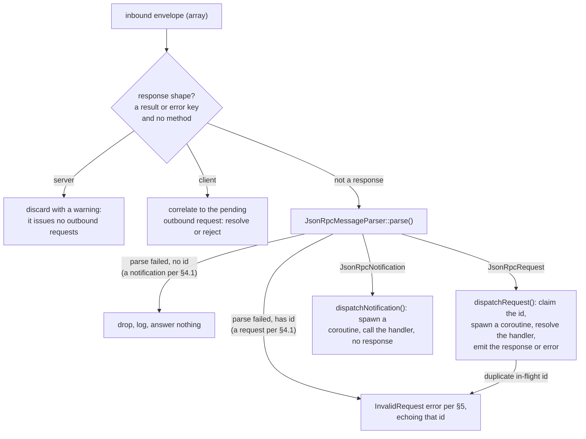

# Architecture

How the SDK is laid out: the namespace tree, the layering rules between namespaces, and the dispatch kernel that
drives every inbound JSON-RPC message. What the SDK covers against the spec is on
[Spec compliance](spec-compliance.md).

## Namespaces

```text
Nexus\Mcp\
├── Core\               Protocol primitives shared by both peers. Depends on no other Mcp namespace
│   ├── Auth\           Authorization vocabulary both peers read: metadata documents, verified tokens, resource identifiers
│   ├── Dispatch\       Shared dispatch contract and in-flight correlation primitives
│   ├── Exception\      McpExceptionInterface marker plus concrete protocol error types
│   ├── Handler\        Handler interfaces, the method-to-handler registry, and the abstract context base
│   │   └── Notification\  Built-in notification handlers both peers register (cancellation)
│   ├── Http\           HTTP vocabulary shared by both sides: status codes, header codecs, Mcp-Param binding and validation
│   ├── JsonRpc\        Envelope parser, method registry, parser-state value objects
│   ├── Schema\         Types only (value objects, enums, interfaces). No behaviour
│   ├── Transport\      Transport contract, lifecycle event keys, shared line-framed duplex, in-memory paired transports for tests
│   ├── UriTemplate\    RFC 6570 Level 1 matching
│   └── Validation\     URI templates, RFC 3339, enum-value coercion
├── Server\             Server-side composition. Depends on Core only
│   ├── Attribute\      #[AsTool], #[AsPrompt], #[AsResource], #[AsResourceTemplate], #[AsCompletion], #[AsServer]
│   ├── Auth\           Resource-server side: the access-token validator contract
│   ├── Completion\     Completion store contract and providers
│   ├── Discovery\      Attribute scanner behind ServerBuilder::register()
│   ├── Dispatch\       Server-side per-envelope inbound pipeline
│   ├── Exception\      Server-side error types
│   ├── Handler\
│   │   └── Request\    Built-in server request handlers
│   ├── Prompt\         Prompt store plus renderer adapters
│   ├── Resource\       Static and templated resource stores plus reader adapters
│   ├── Subscription\   Open subscriptions/listen streams and the fanout that reaches them
│   ├── Tool\           Tool store plus executor adapters
│   ├── Transport\      Server-side transport implementations
│   │   └── Http\       Streamable HTTP endpoint composition
│   │       └── Middleware\  PSR-15 middleware: CORS, DNS rebinding, bearer auth, body size, parameter headers
│   └── Validation\     Pluggable JSON Schema validator contract plus the opis-backed default
└── Client\             Client-side composition. Depends on Core only
    ├── Auth\           OAuth 2.1 client: metadata discovery, registration, token endpoint, the authorizing HTTP decorator
    ├── Dispatch\       Client-side per-envelope inbound pipeline
    ├── Exception\      Client-side local-misuse errors (not connected, already connected, unadvertised server capability)
    ├── Handler\
    │   └── Notification\  Built-in client notification handlers (progress routing)
    ├── Subscription\   Open `subscriptions/listen` streams, their notification routing, and their replay across a reconnect
    └── Transport\      Client-side transport implementations
```

### Layering rules

- **`Core` depends on no other `Nexus\Mcp` namespace.** It is the shared vocabulary that both the server side and
  the client side consume.
- **`Core/Schema/` is types only.** It has no parsers, no codecs, and no registries. That behaviour lives in the
  sibling namespaces `Core/JsonRpc/`, `Core/Validation/`, and `Core/UriTemplate/`.
- **Abstract bases sit at the namespace root.** Their concrete subclasses live in same-named subfolders, such as
  `Schema/Result.php` with `Schema/Result/EmptyResult.php`, and `Schema/Request.php` with
  `Schema/Request/DiscoverRequest.php`.
- **`Server` depends on `Core` only.** Nothing in `Core` references `Server`.
- **`Client` depends on `Core` only.** `Server` and `Client` are symmetric peers. Neither depends on the other.

## The `Arrayable` contract

Every JSON-RPC envelope, params block, and result type implements
[`Nexus\Mcp\Core\Schema\Arrayable`](../src/Core/Schema/Arrayable.php). The contract gives every schema class three
matching shapes:

| Method | Direction |
| --- | --- |
| `static fromArray(array $data): static` | envelope → PHP value object |
| `toArray(): array` | PHP value object → envelope (round-trip representation) |
| `jsonSerialize(): array\|\stdClass` | PHP value object → envelope (what `json_encode` emits) |

### When the two encodings diverge

`toArray()` and `jsonSerialize()` usually return the same shape. Sometimes they diverge on purpose, for example
when an empty object slot must encode as `{}` instead of `[]`. The class then substitutes `\stdClass` in
`jsonSerialize()` and opts in to the `encodingPathsDiverge` flag in the auto-review round-trip fixture registry.
For every other class, `AbstractRoundTripTestCase` asserts `json_encode($x) === json_encode($x->toArray())`, so
drift between the two paths fails the build.

Which path a caller takes is not a free choice. Everything that encodes a message for a peer reads
`jsonSerialize()`, so the substitution survives to the other end. `toArray()` is the round-trip form. It serves
where the envelope stays a PHP array: the in-memory transport handing it to its peer, and `StandardHeaders` reading
values back out of it to mirror into request headers.

### Success responses

A success-response envelope carries no method name, so the parser cannot pick its concrete type from the envelope
alone. `JsonRpcResultResponse` is therefore an abstract base with one self-decoding `*ResultResponse` per method.
The awaiter supplies the expected response class, and the parser delegates to its `fromArray()`
(`JsonRpcMessageParser::parse(..., SomeResultResponse::class)`). A result with no dedicated envelope, such as
`EmptyResult`, rides the `@internal` `GenericResultResponse`.

## The dispatch kernel

Both peers run a per-envelope inbound pipeline behind the shared
[`MessageDispatcherInterface`](../src/Core/Dispatch/MessageDispatcherInterface.php):
[`ServerMessageDispatcher`](../src/Server/Dispatch/ServerMessageDispatcher.php) on the server, and
[`ClientMessageDispatcher`](../src/Client/Dispatch/ClientMessageDispatcher.php) on the client. The two share the
same shape. The structural difference is which direction owns response correlation.



### The ID rule

On a parse failure, the envelope's `id` decides the answer. The method the envelope names never does.

The protocol is stateless. Every inbound request dispatches immediately. It carries the client's identity and
capabilities in its `_meta`, which the server-side handler reads through `ServerContext::$meta`.

A misrouted method takes that same fork. That is a request method sent without an `id`, or a notification method
sent with one. The method name never overrides the envelope: `tools/list` without an `id` is a notification and
goes unanswered, while `notifications/cancelled` with an `id` is a request and gets an error that echoes the ID.

### The answering side

MCP narrows JSON-RPC here rather than following it. §5 mandates a null `id` when the request ID could not be
recovered. MCP types `RequestId` as `int | non-empty-string`, so `JsonRpcErrorResponse` drops the key instead of
emitting `"id": null`. Such a frame goes out as `{"jsonrpc":"2.0","error":{…}}`, and a test pins that encoding.

### Where the two peers diverge

The diagram traces both peers, and they diverge in two places.

The first is the response-shape fork. Only an envelope that names no `method` reaches it. The server discards a
`result` or `error` envelope with a warning. The client correlates it to the pending outbound request it awaits,
resolves on success or rejects on error, and warns on an unknown ("orphan") ID. An envelope that carries a
`method` beside a `result` or an `error` is refused as an invalid request. The refusal echoes the ID when the
envelope carries one.

The second is what each side serves. The revision defines no server-to-client request methods, so a built client's
request registry is empty until a consumer registers a handler. The ID rule still binds both dispatchers equally.
An ID-carrying envelope the client cannot serve gets an error that echoes the ID. The same envelope without an ID
is dropped with a warning.

The client is therefore both a responder and a requester. As a responder, it routes `notifications/progress` to
per-call listeners and answers what it cannot serve. As a requester, it awaits the responses to its own calls, and
`Client::sendRequest()` gates each *outbound* send on the server's advertised capabilities.

### Coroutine draining

Each dispatched request and notification runs in its own `Amp\async` coroutine. The dispatcher tracks them. When
the transport fires its `onDrain` listeners, before the close, the dispatcher awaits every coroutine that still
runs, so in-flight responses flush before the transport closes. Without this, a handler that finishes as the
transport closes would lose its response to a race with the close listeners.

## See also

- **[Spec compliance](spec-compliance.md)**: what ships against the targeted revision, and what is omitted.
- **[Server API](server.md)**: the builder reference.
- **[Client API](client.md)**: the client builder and the typed request reference.
- **[Transports](transports.md)**: the transport contract and lifecycle.
- **[Error handling](error-handling.md)**: the error codes and the diagnostic message grammar.
