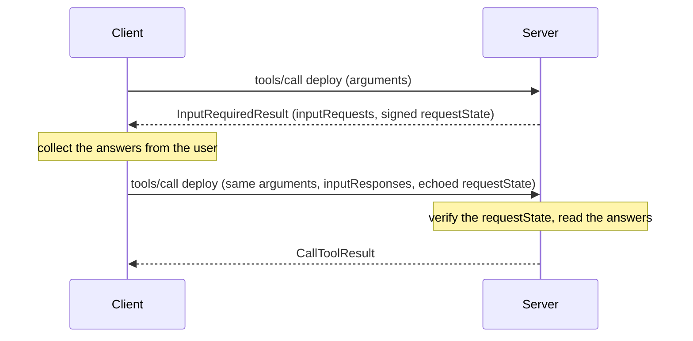

# Asking the client for input

A `tools/call`, `prompts/get`, or `resources/read` handler that cannot finish without something from the client
returns an `InputRequiredResult` instead of its normal result. The client fulfils the requests it names and calls
the same method again, carrying its answers.



```php
$signer = new RequestStateSigner($secretFromConfig);

$builder->addTool(
    tool: new Tool(name: 'deploy', inputSchema: ['type' => 'object']),
    executor: static function (?array $args, ServerContext $context) use ($signer): CallToolResult|InputRequiredResult {
        $answer = $context->inputResponses['confirm'] ?? null;

        if (! $answer instanceof ElicitResult || ElicitAction::Accept !== $answer->action) {
            return new InputRequiredResult(
                inputRequests: ['confirm' => new ElicitRequest(params: new ElicitRequestFormParams(
                    message: 'Deploy to production?',
                    requestedSchema: new ElicitRequestedSchema(
                        properties: ['ok' => new BooleanSchema()],
                        required: ['ok'],
                    ),
                ))],
                requestState: $signer->sign(
                    'awaiting-confirmation',
                    $context->receiveContext->authInfo?->subject ?? '',
                ),
            );
        }

        return new CallToolResult(content: [new TextContent(text: 'Deployed.')]);
    },
)
```

Four things are worth knowing before you write one.

## The client resends only the newest round's answers

Anything an earlier round learned has to travel in `requestState`. That is why a multi-round handler reads its
position from the state, not from an accumulated `inputResponses` map.

## `requestState` is opaque to the client and unverified on arrival

The spec has the client echo the state back untouched, so a hostile client may echo back something else entirely.
`RequestStateSigner` mints and checks it:

```php
$caller = $context->receiveContext->authInfo?->subject ?? '';

// Minting, when the handler asks for input.
$state = $signer->sign('awaiting-confirmation', $caller);

// Checking, when the call comes back. A null state is a first call, not a forgery.
$payload = null === $context->requestState
    ? null
    : $signer->verify($context->requestState, $caller)
        ?? throw new InvalidParamsException($context->requestId, 'The "requestState" failed its integrity check.');
```

`verify()` returns the payload it signed. It returns `null` for a state this server did not mint, or minted under
a different binding. `RequestStateSigner::generate()` draws a key for a server whose states never outlive its own
process. Anything longer-lived wants a key from configuration, so a state survives a restart or a second instance
behind a load balancer.

## Bind the state to whoever is entitled to resume it

The signature answers "did a server holding this secret mint this". On its own, that lets any caller replay any
other caller's state, and a configuration key shared across instances widens that to the whole deployment.

The second argument to `sign()` and `verify()` is folded into the signature, so a state minted for one binding
will not verify under another. The authenticated subject is the usual choice. It is `null` over stdio, on an
unprotected endpoint, and for an accepted token that carries no non-empty `sub` claim. In each case, `?? ''` is
the same as passing no binding at all.

Anything a replaying caller can also send is worthless here. An endpoint that serves more than one caller has no
trustworthy caller identity until something authenticates them, whether the endpoint itself or a proxy in front of
it.

The payload is signed, not encrypted, and travels in the clear. Put a continuation marker in it, never a secret.
Expiry is not built in. Encode a timestamp in the payload and check it after `verify()` if a state should go
stale. A binding stops another caller replaying a state. It does not stop the same caller replaying it later.

## Only elicitation is available to ask for

The spec's `InputRequest` union also admits `sampling/createMessage` and `roots/list`. Both are deprecated as of
2026-07-28 (SEP-2577), and this SDK does not model them. `ElicitRequest` is the only thing a handler can put in
`inputRequests`.

## The field vocabulary

`ElicitRequestedSchema` describes a flat form. Each property is one of the primitive field schemas. Every one
carries an optional `title`, `description`, and `default`, which the client applies when the user leaves the field
alone:

```php
use Nexus\Mcp\Core\Schema\Elicitation\NumberSchema;
use Nexus\Mcp\Core\Schema\Elicitation\StringSchema;
use Nexus\Mcp\Core\Schema\Elicitation\UntitledSingleSelectEnumSchema;

new ElicitRequestedSchema(
    properties: [
        'environment' => new UntitledSingleSelectEnumSchema(
            enum: ['staging', 'production'],
            default: 'staging',
        ),
        'replicas' => new NumberSchema(type: 'integer', minimum: 1, maximum: 12, default: 2),
        'reason' => new StringSchema(maxLength: 200),
    ],
    required: ['environment'],
)
```

`StringSchema` constrains by `minLength`, `maxLength`, and `format`. `NumberSchema` constrains by `minimum` and
`maximum`, and takes `type: 'integer'` for whole numbers. `BooleanSchema` is the yes/no field. Choice fields come
in single-select and multi-select variants, untitled (the value list is what the user sees) and titled (each value
pairs with a display label through `EnumOption`). Nested objects are not part of the vocabulary. Clients render
flat forms.

The answers come back untyped. A client that conforms to the spec applies the defaults and honours the
constraints, but the handler still owns the trust boundary. Read each field from `$context->inputResponses`
defensively, as the example above does with `$answer instanceof ElicitResult`.

## URL mode

A form is one of two elicitation modes. `ElicitRequestUrlParams` instead sends the user to a URL the server names,
such as a checkout page or a device-authorization screen. The client answers once the visit is done:

```php
use Nexus\Mcp\Core\Schema\RequestParams\ElicitRequestUrlParams;

new ElicitRequest(params: new ElicitRequestUrlParams(
    message: 'Complete the payment to continue.',
    mode: 'url',
    url: 'https://pay.example.com/session/8f3a',
))
```

A client declares which modes it supports under its `elicitation` capability: `form`, `url`, or both. The
request's `_meta` carries that declaration per request, so check `$context->meta->clientCapabilities->elicitation`
before you choose a mode.

[`examples/input-required.php`](../../examples/input-required.php) runs the round trip in one process.
[`conformance/MultiRoundServer.php`](../../conformance/MultiRoundServer.php) is the fuller worked example. It
covers a single round, a signed continuation token, a two-question sequence, and the same flow on a prompt. Both
run unauthenticated, so they sign unbound. There is no caller identity there to bind to.
