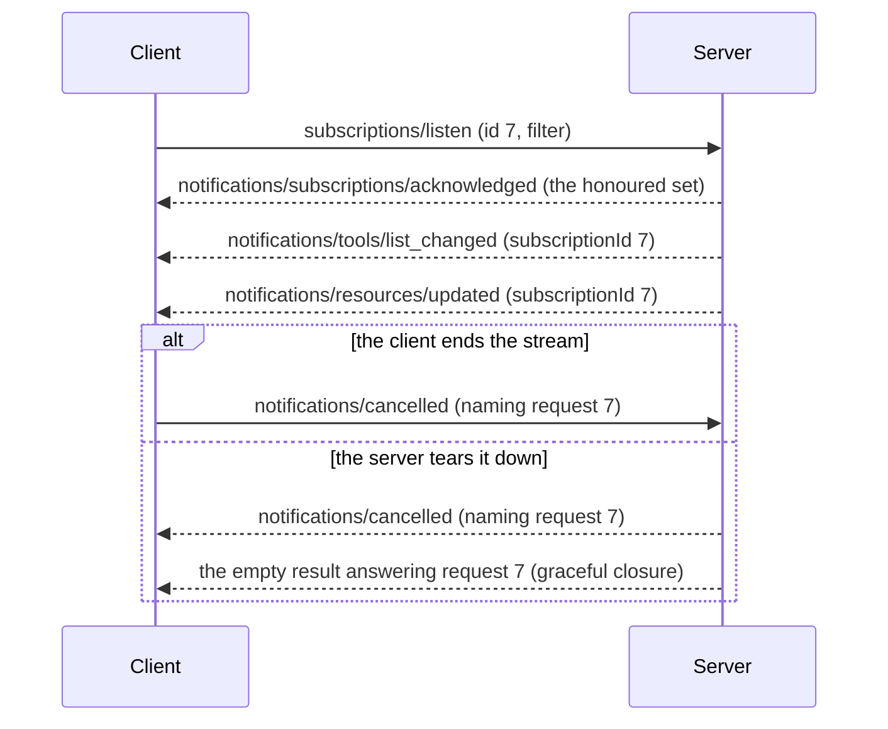

# Subscriptions

`subscriptions/listen` opens a long-lived stream the server pushes notifications down. Register a store to serve
it:

```php
$subscriptions = new SubscriptionStore(
    toolsListChanged: true,
    promptsListChanged: true,
    resourcesListChanged: true,
    resourceSubscriptions: true,
    maxSubscriptions: 1024,
    maxSubscriptionsPerPeer: 256,
    maxResourceSubscriptionsPerStream: 256,
);

$builder->setSubscriptionStore($subscriptions);
```

## Limits

`maxSubscriptions` bounds how many streams one store holds open. It defaults to
`SubscriptionStore::DEFAULT_MAX_SUBSCRIPTIONS` (1024). A listen request past the limit is refused with `-32603`
before any acknowledgement, so the client never sees a stream it does not have.

`maxSubscriptionsPerPeer` bounds the streams one authorized client holds, so a single tenant cannot exhaust the
shared budget. It defaults to `DEFAULT_MAX_SUBSCRIPTIONS_PER_PEER` (256). The peer is the verified token's OAuth
client ID, or its subject when the token names no client. On an unprotected endpoint, requests carry no identity,
so only the server-wide cap applies.

`maxResourceSubscriptionsPerStream` bounds how many resource URIs one stream may watch. It defaults to
`DEFAULT_MAX_RESOURCE_SUBSCRIPTIONS_PER_STREAM` (256). A listen request naming more is refused the same way, and a
client that needs more opens another stream. The cap counts the URIs the store honours, so it does not apply when
`resourceSubscriptions` is off.

## What a listen is acknowledged with

The constructor flags say what this server can deliver. `build()` reads them to derive the `listChanged` and
`subscribe` capabilities.

A listen request is acknowledged with the intersection of three sets: what the client asked for, what those flags
allow, and the `listChanged` types a change-reporting store backs. That is the same set the capabilities
advertise. The acknowledgement is always the first message on the stream. Types the server cannot deliver are
omitted from it rather than denied. A store left at its defaults honours nothing, so nothing is advertised.

Every message on a stream carries `io.modelcontextprotocol/subscriptionId` in `_meta`. It names the ID the client
sent on its `subscriptions/listen` request.



## Announcing changes

Mutating a built-in store announces itself, because `build()` routes each store's `onListChanged()` to the
matching emit. The resource template store routes to `notifications/resources/list_changed` beside the resource
store, since a template expansion changes what the server can read:

```php
$builder->getToolStore()->addTool($tool, $executor);  // reaches every stream that asked for toolsListChanged
```

`build()` may be called once per builder, and every registration method is closed once it has run. A second
`build()`, or any `add*()`, `set*()`, or `register()` after one, throws `LogicException` rather than being
silently dropped. The built server already holds the stores and the list-change listeners.

A store cannot observe resource *contents* changing, so publish that yourself:

```php
$subscriptions->emitResourceUpdated('file:///etc/cfg');
```

Announcements coalesce per event-loop tick, so a burst of mutations reaches each stream once. A `list_changed`
carries no payload, so nothing is lost. The client re-lists either way.

## Ending a stream

A stream ends when the client cancels it, or when the server tears it down with `close($entry)` or `closeAll()`.
The client cancels with `notifications/cancelled` over stdio, or by closing the SSE body over HTTP. A
server-initiated teardown sends the `notifications/cancelled` the spec requires, naming the
`subscriptions/listen` request. It then answers the held-open request with the empty result the spec calls
graceful closure.

`close()` takes the `SubscriptionEntry` that `open()` returned, not a request ID. Request IDs are unique per
connection, and a sessionless endpoint serves many connections through one store, so two clients that both number
their listen request `1` would otherwise share a slot. Use `discard($entry)` to deregister a stream whose client
already walked away. That announces nothing.

`Server` calls `closeAll()` on drain, before it awaits the in-flight coroutines, so a held-open stream cannot block
shutdown. A stream opened after that point is settled immediately rather than held, since `Amp\async()` only
queues a handler and a listen request can first run after the drain began. Attaching the server to a new
transport calls `reopen()`, which clears that drained state, so a reused store serves live streams again.

### Over Streamable HTTP

Over Streamable HTTP, the SDK ignores an inbound `notifications/cancelled` from a client. The spec makes closing
the response stream the cancellation signal there. A client's request ID names its own ID space, not the
transport-internal one the server dispatches under.

A `subscriptions/listen` always answers over SSE, whatever
[`ResponseMode`](../transports/streamable-http.md#streamablehttpservertransport) the transport is configured with.
The buffered path would hold the POST open with nowhere to push the acknowledgement.

### The dispatch cap

A held-open listen coroutine does not count against
[`setMaxInFlightDispatches()`](configuration.md#in-flight-dispatch-cap), and no number of full slots refuses one,
because it opens a subscription rather than being processed. `maxSubscriptions` bounds the streams they open.

`setMaxInFlightDispatches()` sizes a second, separate budget over the listens admitted and not yet started, so
listens that arrive faster than the loop can start them are shed with `-32000`. Being separate, that budget can
refuse a listen while every slot is free.

The exemption is that narrow. A tool handler that awaits slow I/O still holds a slot, since shedding a pile-up of
those is what the cap is for. A server that registers no `subscriptions/listen` handler sheds one like any other
request.
