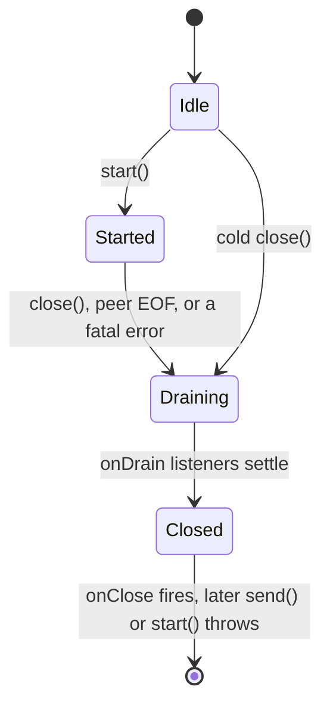

# Transports

A transport is the bytes-in, bytes-out layer between an MCP server and its client. The SDK ships two production
bindings, stdio and Streamable HTTP, on both the server and the client side. It also ships an in-memory pair for
tests (`InMemoryTransport::createPair()`).

| Transport | Side | Shape |
| --- | --- | --- |
| [`StdioServerTransport`](transports/stdio.md#stdioservertransport) | server | Long-lived, newline-delimited JSON over STDIN/STDOUT. Driven by `Server::run()`. |
| [`StdioClientTransport`](transports/stdio.md#stdioclienttransport) | client | Launches the server as a subprocess and speaks the same framing. |
| [`StreamableHttpServerTransport`](transports/streamable-http.md#streamablehttpservertransport) | server | Request-scoped PSR-15 handler. One POST per message. Driven by `Server::listen()`. |
| [`StreamableHttpClientTransport`](transports/streamable-http.md#streamablehttpclienttransport) | client | One POST per outbound message, answered by a JSON object or an SSE stream. |
| [`SupervisedTransport`](transports/supervised.md) | client | Decorator. Respawns a supervisable peer that exits unexpectedly. |
| [`InMemoryTransport`](transports/in-memory.md) | both | Test double pair, no I/O. |

## The contract

Every transport implements
[`Nexus\Mcp\Core\Transport\TransportInterface`](../src/Core/Transport/TransportInterface.php). It is a small
synchronous-looking surface around an async event loop.

```php
interface TransportInterface
{
    public function start(): void;
    public function send(JsonRpcMessage $message, ?SendContext $context = null): void;
    public function close(): void;

    public function onMessage(\Closure $listener): ListenerHandleInterface;
    public function onError(\Closure $listener): ListenerHandleInterface;
    public function onDrain(\Closure $listener): ListenerHandleInterface;
    public function onClose(\Closure $listener): ListenerHandleInterface;
}
```

### Listeners

The four `on*` methods register listeners. The `Server` registers them once, before it calls `start()`:
`onMessage` dispatches, `onError` logs, `onDrain` awaits the in-flight coroutines, and `onClose` resolves the
run-future.

### Closing

`close()` blocks until the close settles. A `close()` from another fiber waits for the close already in progress,
so no caller returns while the drain still runs. After any returned `close()`, a `send()` throws. A close that
re-enters from the closing fiber itself, such as a drain listener or a cascade peer, returns immediately. All
bundled transports honour this uniformly.



Every path into `Closed` passes through the drain exactly once, so the dispatcher always gets to await its
in-flight coroutines. The state flips only after the drain, so a drain listener that settles its last exchange can
still `send()`.

### Inbound IDs

Inbound request IDs are the dispatcher's only correlation key. The dispatcher honours `notifications/cancelled` by
ID alone, with no connection dimension. A transport that serves several peers at once MUST namespace or rewrite
inbound IDs, so two peers' IDs can never collide. Without that, one peer can cancel or answer another peer's
request. `StreamableHttpServerTransport` replaces every inbound ID with an internal one for exactly this reason.
The stdio transports have a single peer, so IDs pass through.

### Send context

`SendContext` carries three slots. A transport is free to ignore all of them.

- `relatedRequestId` ties an out-of-band message, such as a progress notification, to the in-flight request that
  triggered it. A request-scoped transport uses it to route the message onto the right response stream.
- `fromHandler` marks a response that a request handler produced. A request-scoped transport uses it to map the
  response to a transport-level status: a handler error rides HTTP 200 with the JSON-RPC error in the body, and a
  protocol error gets a real status.
- `headers` carries transport headers the protocol layer computed. Today these are the `Mcp-Param-{Name}`
  mirrors a `tools/call` derives from its arguments. Stdio ignores them.

Further transport-specific fields can arrive through the same value object without a change to the interface
shape.

## The bindings

Each binding has its own reference page:

- **[Stdio](transports/stdio.md)**: `StdioServerTransport` and `StdioClientTransport`, line-framed JSON-RPC over
  process streams.
- **[Streamable HTTP](transports/streamable-http.md)**: the PSR-15 server handler with its middleware stack, and
  the one-POST-per-message client.
- **[SupervisedTransport](transports/supervised.md)**: restart supervision, what survives a respawn, and the opt-in
  request retry.
- **[InMemoryTransport](transports/in-memory.md)**: the in-process test pair.

## See also

- **[Getting started](getting-started.md)**: a minimal server with stdio.
- **[Server API](server.md)**: the builder reference, request and notification handlers, and capability
  advertisement.
- **[Client API](client.md)**: the client builder and the typed request reference.
- **[Architecture](architecture.md)**: the dispatch kernel internals.
